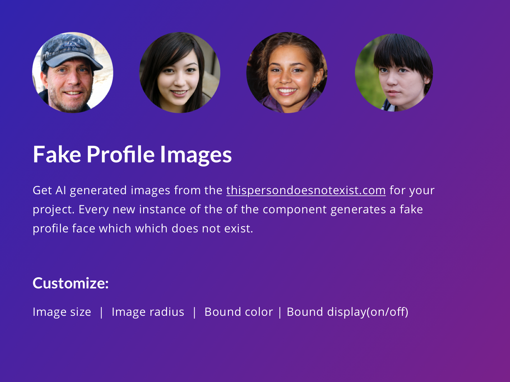

# Fake Profile Image

#### Github repo for the Framer store component, "Fake Profile Image" which allows people to generate a customizable fake profile image generated using GAN's from ["This person does not exist"](https://thispersondoesnotexist.com)

Find the component on the Framer store or look it up here:
[Fake Profile Image](https://store.framer.com/package/atharvapatil/fake-profile-image)

## How does it work?
 

## Over-rides

- Image Size
- Image Radius
- Bound Color
- Bound Display

## Credits
Made with ❤️ by [Atharva Patil](https://atharvapatil.github.io)

Checkout [more Framer work here](https://instagram.com/thatworkedyesterday/).
